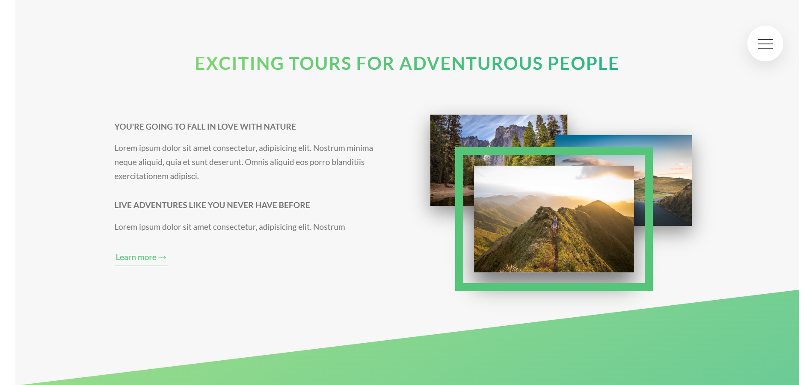

# Natours frontend project

## From the Udemy course thaught by *Jonas Schmedtmann*

> Key learning 

- Be up to speed with the most modern and advanced CSS properties and techniques;

- Have mastered the cutting-edge layout technologies Flexbox and CSS Grid;

- Be ready to build responsive layouts for all kinds of devices and situations;

- Truly understand how CSS works behind the scenes;

- Be able to architect large CSS codebases for reusability and maintainability using **SASS**.

